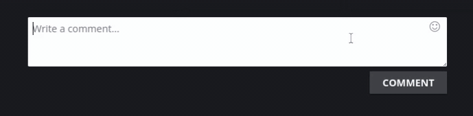

# Emoji Parser
Emoji Parser allows to parse or unparse emojis to use them in KoGaMa.

# Preview

# Emoji Patterns
| Emoji | Pattern |
| -- | -- |
| 😭 | `:sob:`
| 😂 | `:joy:`
| 🥺 | `:pleading_face:`
| 🤣 | `:rofl:`
| ❤️ | `:heart:`
| ✨ | `:sparkles:`
| 🙏 | `:pray:`
| 😍 | `:heart_eyes:`
| 🥰 | `:smiling_face_with_3_hearts:`
| 😊 | `:blush:`
| Others  | All emojis in **[`emoji-list.json`](https://github.com/Devorkk/EmojiParser/blob/main/source/scripts/emoji-list.json)**

# Getting Started
To download this script you need a user-script manager, if you don't have, then check [UserScriptsManager](https://github.com/Devorkk/InstallUserScriptsManager) guide. 
Otherwise, click the button below:

