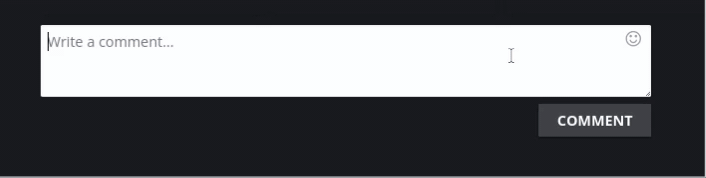

# Emoji Parser
Emoji Parser allows to parse or unparse emojis to use them in KoGaMa.

# Preview

# Emoji Patterns
| Emoji | Pattern |
| -- | -- |
| 😭 | :sob:
| 😂 | :joy:
| 🥺 | :pleading_face:
| 🤣 | :rofl:
| ❤️ | :heart:
| ✨ | :sparkles:
| 🙏 | :pray:
| 😍 | :heart_eyes:
| 🥰 | :smiling_face_with_3_hearts:
| 😊 | :blush:
| **others**  | all emojis in **[`emoji-list.json`](https://raw.githubusercontent.com/Devorkk/EmojiParser/main/source/scripts/EmojiParser.js)**